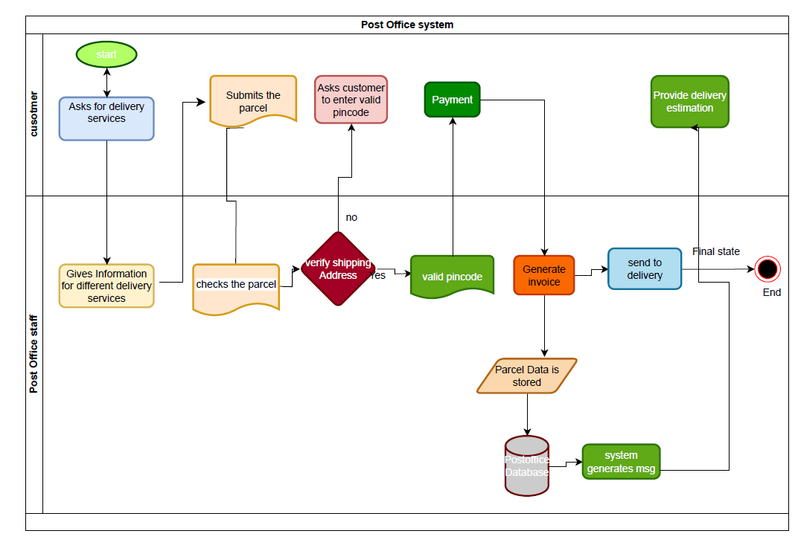

# PostalService
This process flow diagram for postal service gives an overview of the users and staff who use postal services.  
The staff uses an internal system which enters the data of the users and provides the users the details about their parcels/packages.   
The user needs to pay the amount for the usage of the postal services.  
 
